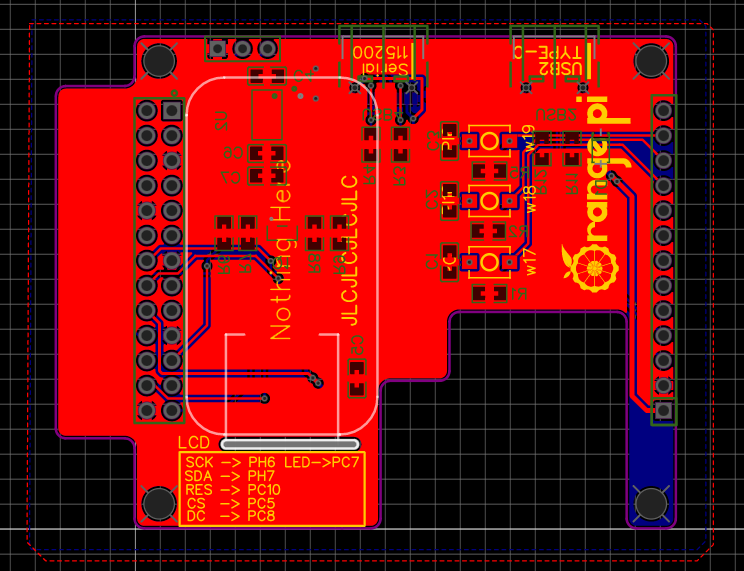
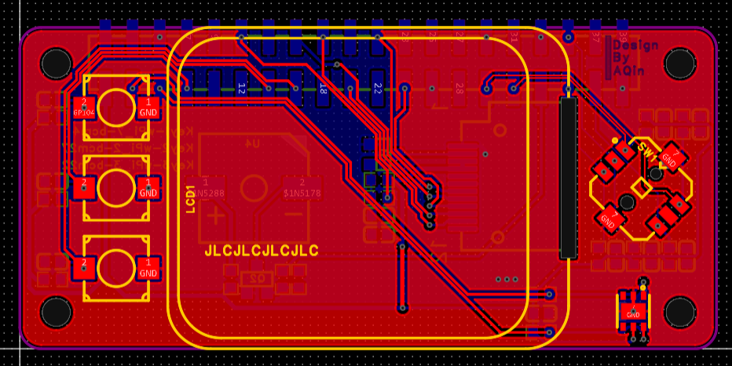

# 设备监控彩屏版

> 基于LVGL的设备监控小屏幕，包含1.69寸LCD（树莓派）和1.47寸LCD（香橙派）两个版本。
>
> 设备信息全，界面美观，简单部署，扩展板可玩性高


代码实际上是通用的，平台的区别实际上是因为扩展板的区别，也就是说在香橙派上连接1.69寸LCD当然也是能用树莓派的代码的，这里为了方便就以平台做区分了


## 香橙派Zero3扩展板&代码（1.47寸LCD st7789 320*172）

### **外观展示**


**PCB**



### 支持的功能

1.47寸LCD 172*320 st7789，三颗按键，USB引出（Type-C），USART转USB接口（CH340N）

### 开源内容

**GuiGuider工程：**.\OrangePi_Zero3\GuiGuider_Proj\DevMonitor_OPi

**源代码：**.\OrangePi_Zero3\Software

**硬件相关（Gerber文件，PCB工程（嘉立创EDA普通版），原理图PDF，BOM表）：**.\OrangePi_Zero3\PCB


### 焊接、物料、注意事项

扩展板不是必须的，如果只需要小屏幕，那就只接个小屏幕也行

屏幕购买链接（仅举例）：https://item.taobao.com/item.htm?_u=9203p1gf487ddb&id=676391119212

焊接物料已导出至BOM表，但是仍然建议使用嘉立创EDA（普通版）打开工程查看封装等信息

2*13P排针大概率买不到，可以买更多的然后自己切掉多余的，双排排针建议买加长的，这样IO在装上扩展板后也是可以用的

板子上有螺丝安装孔，但是实际上左右俩排针已经固定的很紧了，不需要螺丝固定

很巧的是，这个扩展板的高度能让扩展板和香橙派主板之间正好再塞下一个铝合金散热板，但是上面盖住了空气流动性差，所以如果没风扇的话效果一般

如果在嘉立创打样，可以勾选 **“在指定位置添加客编”**这样打出来客编就会在LCD屏幕下面，组装好就会被遮住


## 树莓派Zero2w扩展板&代码（1.69寸LCD st7789 240*280）

### 外观展示


**PCB**



### 支持的功能

1.69寸LCD st7789 240*280，三个无声硅胶按键，五向开关，SHT20（由于Soc发热，温度不准确，有能力编辑PCB的可以去掉，或者空着不焊），蜂鸣器（在背面）

### 开源内容


**GuiGuider工程：**.\RaspberryPi_Zero2w\GuiGuider_Proj\DevMonitor_RPi

**源代码：**.\RaspberryPi_Zero2w\Software

**PCB相关（Gerber文件，BOM表，嘉立创EDA专业版离线工程，原理图PDF）：**.\RaspberryPi_Zero2w\PCB

### 焊接、物料、注意事项

扩展板不是必须的，如果只需要小屏幕，那就只接个小屏幕也行

屏幕购买链接（仅举例）：https://item.taobao.com/item.htm?_u=9203p1gf48353c&id=665384104329

焊接物料已导出至BOM表，但是仍然建议使用嘉立创EDA（专业版）打开工程查看封装等信息

安装孔是M2的

由于Soc发热，SHT20温湿度传感器测量温度不准确，有能力编辑PCB的可以去掉，或者空着不焊

左侧三个按键是硅胶静音按键

如果在嘉立创打样，可以勾选 **“在指定位置添加客编”**这样打出来客编就会在LCD屏幕下面，组装好就会被遮住


## 编译 & 运行

> 由于两个工程极为相似，大致过程也基本一样，所以此处以香橙派Zero3为例演示，操作需要一定知识，都可以在香橙派的用户手册内查到，如果您没有使用对应的扩展板，连接屏幕时可以按**inc/st7789.h**内的说明来连接，或者参考下一节“**更改代码**”

0）需要的软件：

```
wiringPi 	#参考香橙派手册安装（香橙派的叫wiringOP），树莓派可以百度安装方法
gcc 	    #系统自带
make        #系统自带
cmake       #使用apt安装
```

1）获取代码

```
git clone https://github.com/Temperature6/DevMonitor_for_Pis.git
```

2）进入目录对应开发板的目录

```
cd DevMonitor_for_Pis/OrangePi_Zero3/Software
```

3）准备编译，创建build目录

```
mkdir build
```

4）进入build目录

```
cd build
```

5）生成makefile（注意cmake后面是两个点 “..”）

```
cmake ..
```

6）生成

```
make
```

文件数量较多，如果没有其他重要任务，CPU空闲，可以使用如下命令，这样就可以让H618的四核CPU都进行编译工作

```
make -j4
```

7）完成

不出意外的话，上级目录如图

```
root@orangepizero3:***/DevMonitor_LVGL_OPi/build# ls ..
build  CMakeLists.txt  devmonitor_lvgl_opi  guiguider  inc  lvgl  res  src
```

“devmonitor_lvgl_opi”为最终的可执行文件，运行即可

```
cd ..
sudo ./devmonitor_lvgl_opi
```

程序涉及到硬件操作，需要root权限，请以root用户运行或使用sudo提权


8）可以把程序添加到自启动，这里举一种添加开机自启动的例子

```
sudo vim /etc/rc.local
```

文件内容如下

```
#!/bin/sh -e
#
# rc.local
#
# This script is executed at the end of each multiuser runlevel.
# Make sure that the script will "exit 0" on success or any other
# value on error.
#
# In order to enable or disable this script just change the execution
# bits.
#
# By default this script does nothing.

您的路径/devmonitor_lvgl_opi &

exit 0

```

**注意在命令之后一定要加 “&” 使程序在后台运行**


## 更改代码

> 为了适用不同接线方式，需要更改代码，大部分都是屏幕相关引脚的更改
>
> 驱动代码参考连接：[Floyd-Fish/ST7789-STM32: using STM32's Hardware SPI to drive a ST7789 based IPS displayer (github.com)](https://github.com/Floyd-Fish/ST7789-STM32)

1）屏幕相关：inc/st7789.h

```c
#ifndef __ST7789_H
#define __ST7789_H
#include "fonts.h"
/* choose a Hardware SPI port to use. */
#define ST7789_SPI_CHANNAL  1           //配置要用的SPI外设
#define ST7789_SPI_PORT     1           //
#define ST7789_SPI_SPEED    900000000   //通信速率
/* If u need CS control, comment below*/
//#define CFG_NO_CS

/* Pin connection*/
#define ST7789_RST_PIN      16      //PC10
#define ST7789_DC_PIN       8       //PC8

#ifndef CFG_NO_CS
#define ST7789_CS_PIN       7       //PC5
#endif

/* If u need Backlight control, uncomment below */
//#define BLK_PORT
#define BLK_PIN             13      //PC7
```

**ST7789_SPI_CHANNAL：**定义的屏幕接到的SPI通道，可以使用如下命令查看/dev目录下的spi设备

```
root@orangepizero3:~# ls /dev/spi*
/dev/spidev1.1
```

如果没有列出设备，说明没有开启，香橙派可以用orangepi-config打开，树莓派可以用raspi-config打开，具体打开方法可以百度 香橙派/树莓派如何打开SPI

spidev1.1指的是spi1外设的下的cs1

**ST7789_SPI_PORT：**定义的屏幕的CS引脚接到的位置，实际上是用不到的，本程序使用软件控制CS引脚，但是不能瞎填，如果/dev目录下有/dev/spidev1.1和/dev/spidev1.2，那就只能填1或2

**ST7789_RST_PIN：**屏幕的LCD引脚连接的位置，后面的数字指的是wPi值，可以使用如下命令查看

```
***@orangepizero3:~$ gpio readall
 +------+-----+----------+------+---+   H616   +---+------+----------+-----+------+
 | GPIO | wPi |   Name   | Mode | V | Physical | V | Mode | Name     | wPi | GPIO |
 +------+-----+----------+------+---+----++----+---+------+----------+-----+------+
 |      |     |     3.3V |      |   |  1 || 2  |   |      | 5V       |     |      |
 |  229 |   0 |    SDA.3 | ALT5 | 0 |  3 || 4  |   |      | 5V       |     |      |
 |  228 |   1 |    SCL.3 | ALT5 | 0 |  5 || 6  |   |      | GND      |     |      |
 |   73 |   2 |      PC9 |  OFF | 0 |  7 || 8  | 0 | OFF  | TXD.5    | 3   | 226  |
 |      |     |      GND |      |   |  9 || 10 | 0 | OFF  | RXD.5    | 4   | 227  |
 |   70 |   5 |      PC6 | ALT5 | 0 | 11 || 12 | 0 | OFF  | PC11     | 6   | 75   |
 |   69 |   7 |      PC5 |  OUT | 1 | 13 || 14 |   |      | GND      |     |      |
 |   72 |   8 |      PC8 |  OUT | 1 | 15 || 16 | 0 | OFF  | PC15     | 9   | 79   |
 |      |     |     3.3V |      |   | 17 || 18 | 0 | OFF  | PC14     | 10  | 78   |
 |  231 |  11 |   MOSI.1 | ALT4 | 0 | 19 || 20 |   |      | GND      |     |      |
 |  232 |  12 |   MISO.1 | ALT4 | 0 | 21 || 22 | 1 | OUT  | PC7      | 13  | 71   |
 |  230 |  14 |   SCLK.1 | ALT4 | 0 | 23 || 24 | 0 | ALT4 | CE.1     | 15  | 233  |
 |      |     |      GND |      |   | 25 || 26 | 1 | OUT  | PC10     | 16  | 74   |
 |   65 |  17 |      PC1 |  OFF | 0 | 27 || 28 |   |      |          |     |      |
 |  272 |  18 |     PI16 | ALT2 | 0 | 29 || 30 |   |      |          |     |      |
 |  262 |  19 |      PI6 |  OFF | 0 | 31 || 32 |   |      |          |     |      |
 |  234 |  20 |     PH10 | ALT3 | 0 | 33 || 34 |   |      |          |     |      |
 +------+-----+----------+------+---+----++----+---+------+----------+-----+------+
 | GPIO | wPi |   Name   | Mode | V | Physical | V | Mode | Name     | wPi | GPIO |
 +------+-----+----------+------+---+   H616   +---+------+----------+-----+------+
```

wPi列就是引脚名对应的wPi值，在使用C语言开发的wiringPi下使用wPi来指定引脚

**ST7789_DC_PIN：**LCD屏的数据/命令选择引脚，其他说明参考上面的ST7789_RST_PIN

**ST7789_CS_PIN：**LCD屏的片选引脚，如果使用的屏幕模块自带拉低CS，可以取消注释“#define CFG_NO_CS”，其他说明参考上面的ST7789_RST_PIN

**BLK_PIN：**LCD屏幕的背光控制引脚，如果屏幕模块自带上电打开背光，不需要接，程序内没有控制背光的操作


## 参考内容

st7789的驱动

[Floyd-Fish/ST7789-STM32: using STM32's Hardware SPI to drive a ST7789 based IPS displayer (github.com)](https://github.com/Floyd-Fish/ST7789-STM32)

使用的LVGL版本是8.3.5

[lvgl/lvgl: Embedded graphics library to create beautiful UIs for any MCU, MPU and display type. (github.com)](https://github.com/lvgl/lvgl)

